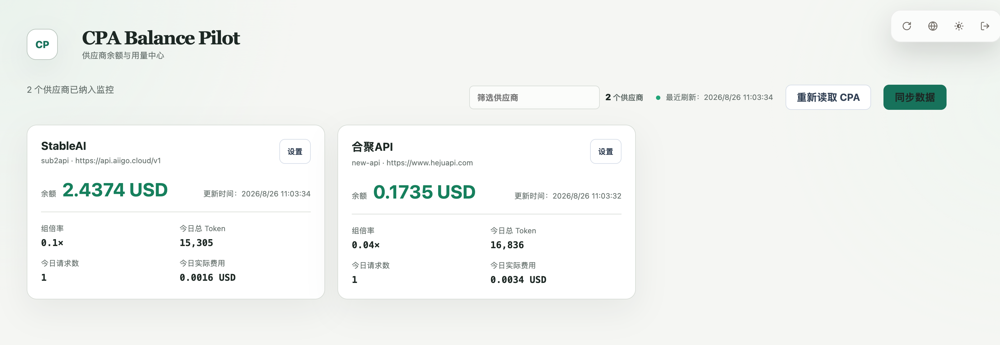

# CPA Balance Pilot

CPA Balance Pilot 是一个原生 [CLIProxyAPI](https://github.com/router-for-me/CLIProxyAPI) 插件，用于读取 CPA 管理 API 中配置的静态 AI 供应商，并跟踪被选供应商的余额。插件不会修改 CPA 本身。



## 核心功能

- 支持 sub2api/new-api 中转余额、当日用量同步及展示。
- 使用 SQLite 保存配置、凭据、查询结果，API Key 与认证信息采用 AES-256-GCM 加密。

## 安装与使用

下载适用于 CPA 主机平台的插件，并将动态库放入 CPA 的插件目录，保持文件名不变：

```text
plugins/windows/amd64/cpa-balance-pilot.dll
plugins/linux/amd64/cpa-balance-pilot.so
plugins/darwin/arm64/cpa-balance-pilot.dylib
```

`CPA_BALANCE_PILOT_KEY` 必填；提供的 32 字节主密钥加密保存
`CPA_BALANCE_PILOT_DATA_DIR` 可省略，此时使用默认目录。
在 CPA 中启用插件后，从管理中心的插件菜单打开 `CPA Balance Pilot`，插件会自动复用 CPA 管理中心当前会话（无需再次手动输入 Management Key）。余额信息显示在插件自己的管理页面中。

生成密钥示例：

```bash
openssl rand -base64 32
```
## License

[MIT](./LICENSE)
